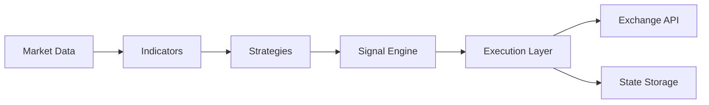

# Aster Futures Trading Bot

A TypeScript trading bot for Aster futures markets with dry-run, paper, live, and historical backtesting modes.

## Features

- Multiple strategy engines: Watermellon, Peach Hybrid, Swing, EMA Cross, RSI Reversion
- Dry-run mode for signal and execution logging
- Paper trading with simulated balance and per-symbol PnL tracking
- Live trading through Aster futures APIs
- Historical backtesting from candle CSV files
- Zod-based environment validation
- Risk controls for position caps, leverage, slippage, retries, drawdown, and trade frequency
- Jest test suite and TypeScript checking

## Architecture



## Backtesting

Backtesting simulates the configured strategy on historical candle data before live trading.


### Components

- Data Loader: reads historical candles from CSV.
- Simulation Engine: feeds candles into the selected strategy engine.
- Execution Simulator: opens, flips, and closes simulated positions with configurable fees and slippage.
- Metrics: reports PnL, win rate, drawdown, profit factor, and recent trades.

### CSV Format

Required columns:

```csv
timestamp,open,high,low,close,volume
```

Optional columns:

```csv
symbol,buyVolume,sellVolume
```

Example:

```csv
timestamp,symbol,open,high,low,close,volume,buyVolume,sellVolume
2026-01-01T00:00:00.000Z,BTCUSDT-PERP,100,105,99,104,10,7,3
2026-01-01T00:01:00.000Z,BTCUSDT-PERP,104,106,103,105,12,8,4
```

`timestamp` can be an ISO date or epoch milliseconds. If `symbol` is omitted, the first configured `PAIR_SYMBOL` is used. If `buyVolume` and `sellVolume` are omitted, volume is split evenly.

### Run A Backtest

```bash
npm run backtest -- --file data/history/BTCUSDT-1m.csv
```

Optional arguments:

```bash
npm run backtest -- \
  --file data/history/BTCUSDT-1m.csv \
  --symbol BTCUSDT-PERP \
  --balance 10000 \
  --position-size 30 \
  --fee-rate 0.04 \
  --slippage 0.02
```

Arguments:

- `--file`: path to historical candle CSV.
- `--symbol`: fallback symbol when CSV has no `symbol` column.
- `--balance`: simulated starting balance in USDT. Default: `10000`.
- `--position-size`: simulated notional size per trade in USDT. Default: `MAX_POSITION_USDT`.
- `--fee-rate`: fee percentage per side. Default: `0.04`.
- `--slippage`: slippage percentage per fill. Default: `0.02`.

Backtesting uses the configured `STRATEGY_TYPE` and strategy parameters from `.env`, but forces paper-style execution so it never sends exchange orders.

## Installation

```bash
npm install
```

## Configuration

Copy `env.example` to `.env` and edit values for your environment.

Key settings:

```env
MODE=dry-run
PAPER_TRADING=true
PAIR_SYMBOL=BTCUSDT-PERP
STRATEGY_TYPE=rsi-reversion
MAX_POSITION_USDT=30
MAX_LEVERAGE=5
ENABLE_DYNAMIC_PAIR_RANKING=false
```

Live mode requires:

```env
MODE=live
PAPER_TRADING=false
ASTER_API_KEY=...
ASTER_PRIVATE_KEY=...
```

## Usage

Run the bot:

```bash
npm run bot
```

Run a backtest:

```bash
npm run backtest -- --file data/history/BTCUSDT-1m.csv
```

Run tests:

```bash
npm test -- --runInBand
```

Type-check:

```bash
npx tsc --noEmit
```

## Modes

| Mode | Description |
| --- | --- |
| `dry-run` | Logs intended trades without live execution or paper PnL. |
| `paper` | Simulates trades with a virtual balance. |
| `live` | Sends real orders to Aster. Use only after testing. |
| `backtest` | Replays historical candles through the simulation engine. |

## Project Structure

```text
src/
  backtest/             CLI entrypoint for historical simulation
  bot/                  Live bot entrypoint
  lib/
    backtest/           Data loader, simulator, metrics
    bot/                Runtime orchestration and risk controls
    execution/          Dry-run, paper, and live executors
    indicators/         EMA, RSI, ATR, ADX, slope
    rest/               REST polling
    state/              Position and warm-state persistence
```

## Risk Disclaimer

This software is for educational purposes only. Trading cryptocurrencies involves substantial risk and can result in loss of capital. Backtest results are simulations and do not guarantee live performance.

Use at your own risk.
