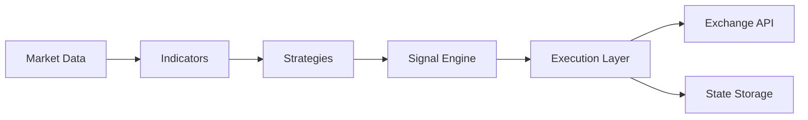

# Aster Futures Trading Bot

A TypeScript trading bot for Aster futures markets with dry-run, paper, live, and historical backtesting modes.

## Features

- Multiple strategy engines: Watermellon, Peach Hybrid, Swing, EMA Cross, RSI Reversion
- Dry-run mode for signal and execution logging
- Paper trading with simulated balance and per-symbol PnL tracking
- Live trading through Aster futures APIs
- Historical backtesting from candle CSV files
- Zod-based environment validation
- Risk controls for position caps, leverage, slippage, retries, drawdown, and trade frequency
- Jest test suite and TypeScript checking

## Architecture



## Backtesting

Backtesting simulates the configured strategy on historical candle data before live trading.


### Components

- Data Loader: reads historical candles from CSV.
- Simulation Engine: feeds candles into the selected strategy engine.
- Execution Simulator: opens, flips, and closes simulated positions with configurable fees and slippage.
- Metrics: reports PnL, win rate, drawdown, profit factor, and recent trades.

### CSV Format

Required columns:

```csv
timestamp,open,high,low,close,volume
```

Optional columns:

```csv
symbol,buyVolume,sellVolume
```

Example:

```csv
timestamp,symbol,open,high,low,close,volume,buyVolume,sellVolume
2026-01-01T00:00:00.000Z,BTCUSDT-PERP,100,105,99,104,10,7,3
2026-01-01T00:01:00.000Z,BTCUSDT-PERP,104,106,103,105,12,8,4
```

`timestamp` can be an ISO date or epoch milliseconds. If `symbol` is omitted, the first configured `PAIR_SYMBOL` is used. If `buyVolume` and `sellVolume` are omitted, volume is split evenly.

### Run A Backtest

```bash
npm run backtest -- --file data/history/BTCUSDT-1m.csv
```

Optional arguments:

```bash
npm run backtest -- \
  --file data/history/BTCUSDT-1m.csv \
  --symbol BTCUSDT-PERP \
  --balance 10000 \
  --position-size 30 \
  --fee-rate 0.04 \
  --slippage 0.02 \
  --pessimistic \
  --tick-size 0.1 \
  --missed-fill-pct 10 \
  --latency-bars 1
```

Arguments:

- `--file`: path to historical candle CSV.
- `--symbol`: fallback symbol when CSV has no `symbol` column.
- `--balance`: simulated starting balance in USDT. Default: `10000`.
- `--position-size`: simulated notional size per trade in USDT. Default: `MAX_POSITION_USDT`.
- `--fee-rate`: fee percentage per side. Default: `0.04`.
- `--slippage`: slippage percentage per fill. Default: `0.02`.
- `--pessimistic`: enables worse fills, random missed fills, and delayed execution.
- `--tick-size`: exchange tick size used for pessimistic fill adjustment.
- `--missed-fill-pct`: percentage of signals skipped as missed fills in pessimistic mode.
- `--latency-bars`: number of bars to delay signal execution in pessimistic mode.

Backtesting uses the configured `STRATEGY_TYPE` and strategy parameters from `.env`, but forces paper-style execution so it never sends exchange orders.
Backtest output includes expectancy, PnL grouped by volatility regime, and guard-block counts. The simulator now approximates spread/funding filters, portfolio exposure caps, daily loss halts, cooldowns, ATR sizing, and partial take-profit behavior.

### Current Backtest Limits

The backtest module is useful for strategy screening, but it is not a full live-execution replica yet. It does not fully model:

- Live funding and premium freshness from exchange polling.
- The bot runner's dynamic ATR stop lifecycle and partial-take-profit state.
- Multi-strategy ownership and takeover timing.
- Exchange-specific behavior such as lot-size rounding, rejected reduce-only orders, leverage caps, rate limits, and order-book fill quality.

Treat backtest results as a first-pass filter. Run paper mode before live mode.

## Installation

```bash
npm install
```

## Configuration

Copy `env.example` to `.env` and edit values for your environment.

Key settings:

```env
MODE=dry-run
PAPER_TRADING=true
PAIR_SYMBOL=BTCUSDT-PERP
STRATEGY_TYPE=rsi-reversion
MAX_POSITION_USDT=25
MAX_PORTFOLIO_EXPOSURE_USDT=25
MAX_LEVERAGE=5
ENABLE_DYNAMIC_PAIR_RANKING=false
MAX_DAILY_LOSS_PCT=1
MAX_DRAWDOWN_PCT=2
RISK_PER_TRADE_PCT=0.5
MIN_ATR_PCT=0.03
MAX_ATR_PCT=3.0
MAX_LONG_FUNDING_RATE=0.0005
MIN_SHORT_FUNDING_RATE=-0.0005
MAX_SPREAD_PCT=0.08
REQUIRE_FRESH_PERP_SIGNALS=true
PERP_SIGNAL_MAX_AGE_MS=600000
EMERGENCY_FLATTEN_ON_RISK_HALT=true
TRADING_DAY_TIMEZONE_OFFSET_MINUTES=0
ORDER_RECONCILE_INTERVAL_MS=30000
MAX_ORDER_AGE_MS=300000
# MIN_BOOK_DEPTH_USDT=1000
```

Live mode requires:

```env
MODE=live
PAPER_TRADING=false
ASTER_API_KEY=...
ASTER_PRIVATE_KEY=...
```

## Usage

Run the bot:

```bash
npm run bot
```

Run a backtest:

```bash
npm run backtest -- --file data/history/BTCUSDT-1m.csv
```

Run tests:

```bash
npm test -- --runInBand
```

Type-check:

```bash
npx tsc --noEmit
```

## Modes

| Mode | Description |
| --- | --- |
| `dry-run` | Logs intended trades without live execution or paper PnL. |
| `paper` | Simulates trades with a virtual balance. |
| `live` | Sends real orders to Aster. Use only after testing. |
| `backtest` | Replays historical candles through the simulation engine. |

## Live Safety Checks

- Startup waits for both balance and the first REST position reconciliation before tick streams begin.
- Live mode runs a preflight check before start and refuses to run if balance, positions, symbol/premium, or open-order checks fail.
- The websocket subscribes to `aggTrade` and `bookTicker`; strategy bars use trades, while bid/ask quotes feed spread checks.
- Live entries are blocked by slippage, spread, optional book-depth, volatility, funding, premium, portfolio exposure, daily loss, and drawdown guards.
- Duplicate live entry/close orders for the same symbol are blocked while an order is already in flight.
- Risk halts persist across restarts and can emergency-flatten open positions when `EMERGENCY_FLATTEN_ON_RISK_HALT=true`.
- The trading-day reset uses `TRADING_DAY_TIMEZONE_OFFSET_MINUTES`; the default is UTC.
- Funding/premium data must be fresh when `REQUIRE_FRESH_PERP_SIGNALS=true`.
- A reconciliation loop compares local state with exchange positions/open orders and cancels stale orders older than `MAX_ORDER_AGE_MS`.
- Reduce-only close failures fail closed; the bot does not retry a live close as non-reduce-only while REST still shows an open position.
- PnL snapshots are logged every minute with balance, daily realized PnL, unrealized PnL, total PnL, drawdown, and active position count.
- Performance metrics include signal counts, entries, and block reasons so you can separate weak signal quality from risk filters doing their job.

## Project Structure

```text
src/
  backtest/             CLI entrypoint for historical simulation
  bot/                  Live bot entrypoint
  lib/
    backtest/           Data loader, simulator, metrics
    bot/                Runtime orchestration and risk controls
    execution/          Dry-run, paper, and live executors
    indicators/         EMA, RSI, ATR, ADX, slope
    rest/               REST polling
    state/              Position and warm-state persistence
```

## Risk Disclaimer

This software is for educational purposes only. Trading cryptocurrencies involves substantial risk and can result in loss of capital. Backtest results are simulations and do not guarantee live performance.

Use at your own risk.
